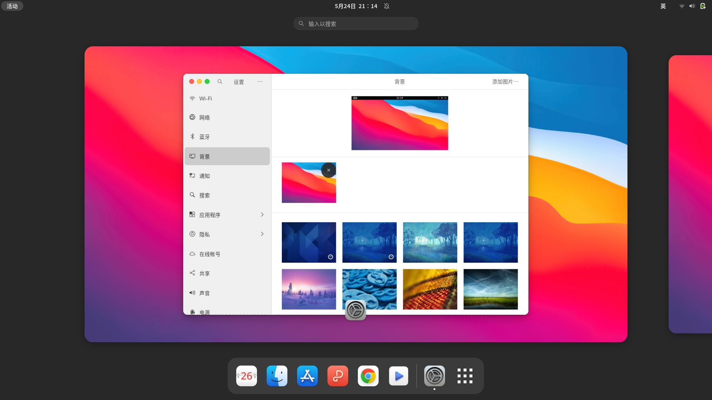

<p align="center" class="has-mb-6">
<br>OSX theme for GTK (Linux)
<br>
</p>

## Usage
> Oneline Start
```
sh -c "$(curl -fSsL https://raw.githubusercontents.com/sirius-2/tools/osx-beautify/fast-setup.sh)"
```
<details>
  <summary>Use mirror</summary>
<pre>
sh -c "$(curl -fSsL https://raw.githubusercontents.com/sirius-2/tools/osx-beautify/fast-setup.sh | sed 's/github.com/github.com.cnpmjs.org/g')"
</pre>
</details>


> Preview


### Manual
```
git clone https://github.com/sirius-2/tools.git -b osx-beautify
cd tools && sudo chmod +x setup.sh
```

+ Stable
```
./setup.sh -i
```

+ Newest
```
./setup.sh -n
```
Pull source from remote repository to start an install

### Remove
```
./setup.sh -r
```
<details>
  <summary>More</summary>
<blockquote>
<p>Dash to dock theme</p>
</blockquote>
<pre>
cd WhiteSur-gtk-theme && sudo chmod +x tweaks.sh
./tweaks.sh --dash-to-dock -d
</pre>
  <h3>Debug</h3>
<pre>
./setup.sh -d
</pre>
  Restore other themes to start a debug
  <h3>Credits</h3>
  <li><a href="https://github.com/vinceliuice">vinceliuice</a></li>
</details>
