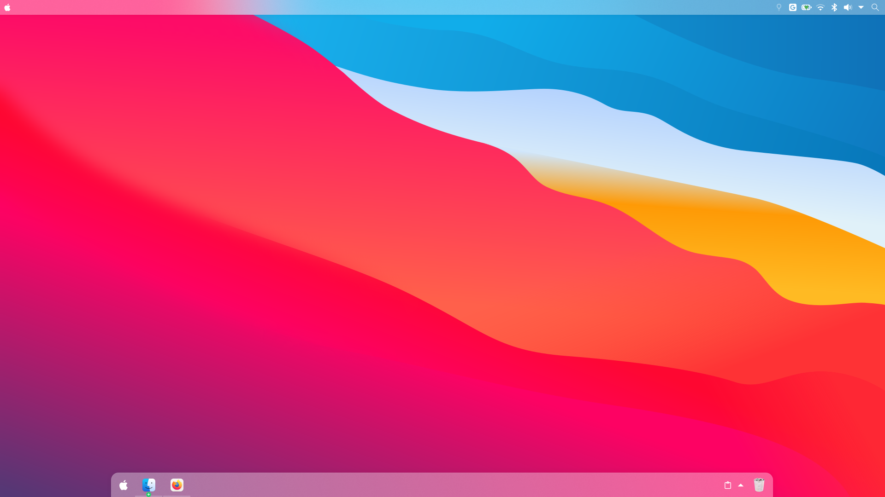

# Theme for Plasma
> 到外观设置[左下]勾选使用主题布局启用最佳效果   

Usage:
> Oneline Start
```
sh -c "$(curl -fSsL https://raw.githubusercontents.com/sirius-2/WhiteSur-desktop/beautify-plasma/fast-setup.sh)"
```

## Mannual
```
git clone https://github.com:sirius-2/tools.git -b beautify-plasma
sudo chmod +x setup.sh
./setup -i
```


